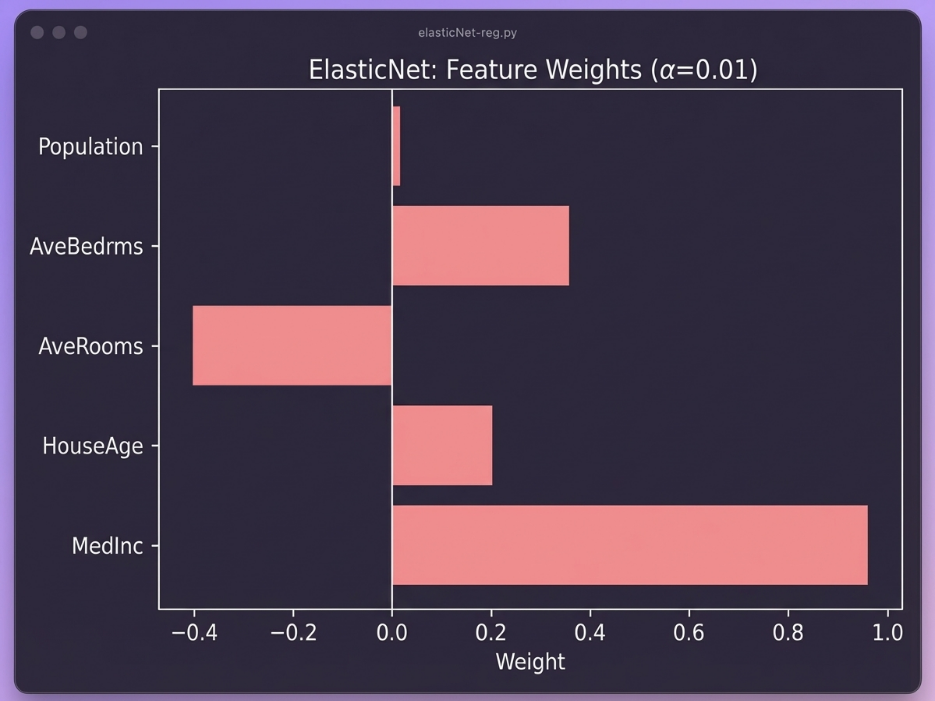
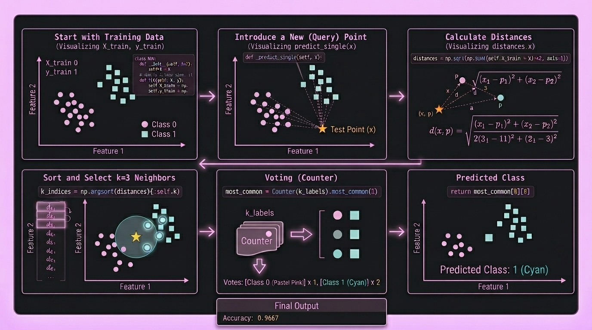

# Machine Learning from Scratch using Python

Implementing classical ML models from scratch using only NumPy, and building small projects alongside for deeper understanding. No sklearn for model logic — just math and code.

Following the [roadmap.sh/machine-learning](https://roadmap.sh/machine-learning) roadmap — see [ROADMAP.md](ROADMAP.md) for full progress tracker.

## Progress

| Category | Models | Status |
|----------|--------|--------|
| Regression | Linear, Multiple, Lasso, Ridge, ElasticNet |  Complete |
| Classification | KNN, Logistic Regression, SVM, Decision Trees, Random Forest |  Complete |
| Unsupervised | K-Means, DBSCAN, PCA, ... |  Up next |

## Models Implemented

### Regression
| Model | Code |
|-------|------|
| Simple Linear Regression | [`SLR-byhand.py`](Regression/SLR-byhand.py) |
| Multiple Linear Regression | [`MLR-byhand.py`](Regression/MLR-byhand.py) |
| Ridge Regression | [`LR-ridge.py`](Regression/LR-ridge.py) |
| Lasso Regression | [`LR-lasso.py`](Regression/LR-lasso.py) |
| ElasticNet Regression | [`elasticnet_from_scratch.py`](Regression/elasticnet_from_scratch.py) |

### Classification
| Model | Code |
|-------|------|
| KNN (K-Nearest Neighbors) | [`KNN-byhand.py`](Classification/KNN-byhand.py) |
| Logistic Regression | [`log-regbyhand.py`](Classification/log-regbyhand.py) |
| SVM (Support Vector Machine) | [`SVM-byhand.py`](Classification/SVM-byhand.py) |
| Decision Trees | [`DecisionTrees-byhand.py`](Classification/DecisionTrees-byhand.py) |
| Random Forest | [`Randomforest-byhand.py`](Classification/Randomforest-byhand.py) |
| Gradient Boosting Machines | [`GradientBoostingMachines-byhand.py`](Classification/GradientBoostingMachines-byhand.py) |

## Projects

| Project | Dataset | Model | Code |
|---------|---------|-------|------|
| Titanic Survival Prediction | [Kaggle Titanic](https://www.kaggle.com/c/titanic) | Logistic Regression (from scratch) | [`log-reg-titanic.ipynb`](Classification/Projects/Titanic-Survival/log-reg-titanic.ipynb) |
| Spam Detection | [SMS Spam Collection](https://www.kaggle.com/datasets/uciml/sms-spam-collection-dataset) | SVM (from scratch) | [`svm-spamdetection.ipynb`](Classification/Projects/SVM-Proj/svm-spamdetection.ipynb) |

## Visualisations

### Regression

| Model | Output |
|-------|--------|
| **Simple Linear Regression** |  |
| **Multiple Linear Regression** |  |
| **Lasso Regression** |  |
| **Ridge & Lasso** |  |
| **ElasticNet** |  |

### Classification

| Model | Output |
|-------|--------|
| **KNN** |  |
