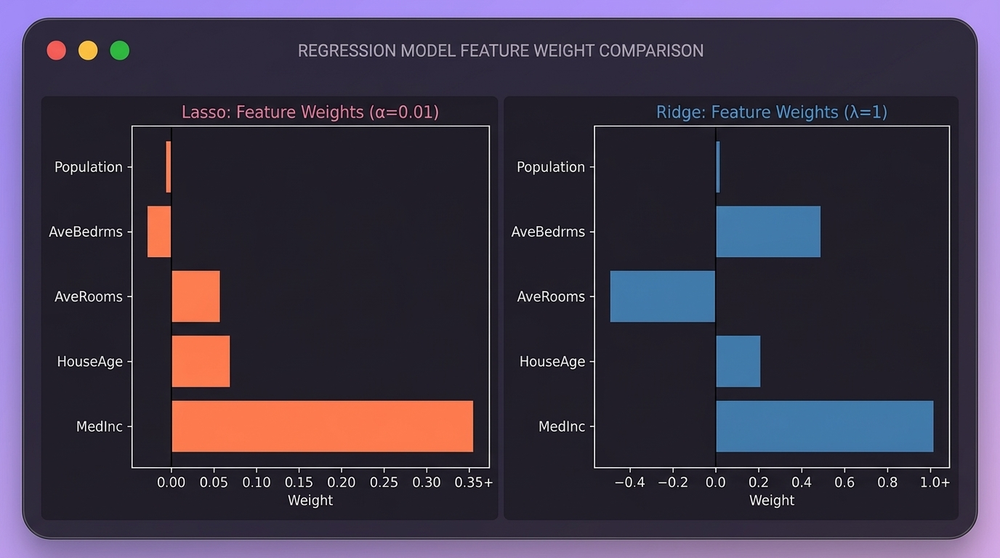

# Machine Learning Practice
Just revsiting classical ML models and coding them by hand. I've used the California Housing Dataset from sklearn for all these. 

## Simple Linear Regression

  

---

## Multiple Linear Regression

  

  

---

## Lasso Regression

  

---

## Ridge & Lasso Regression

  

---
